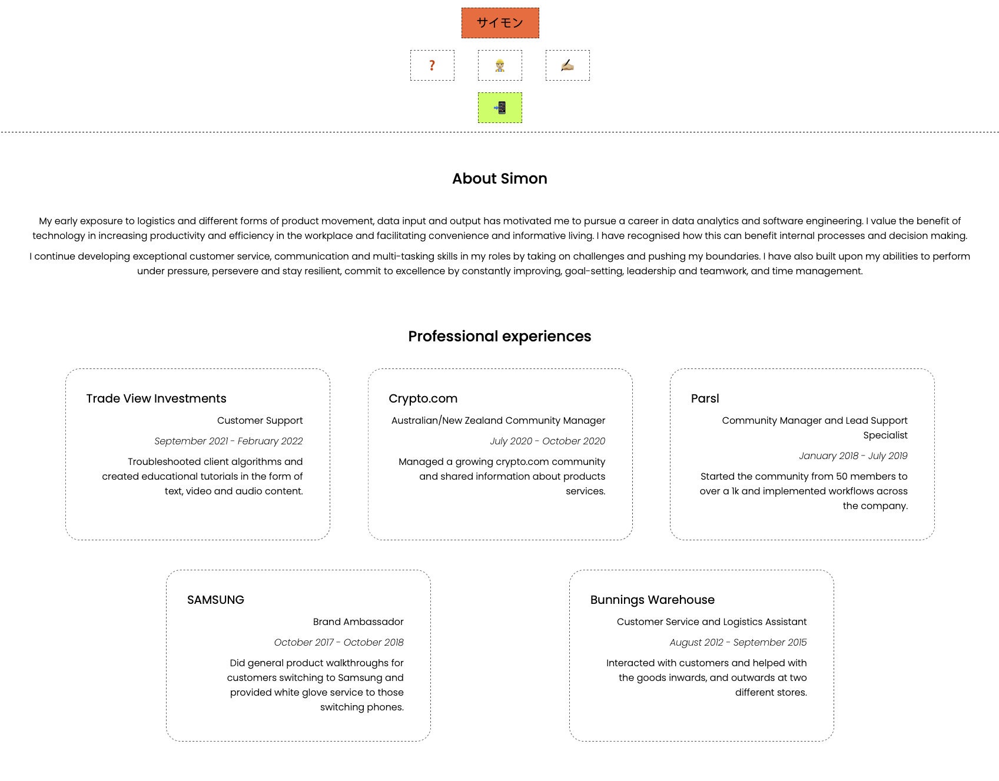
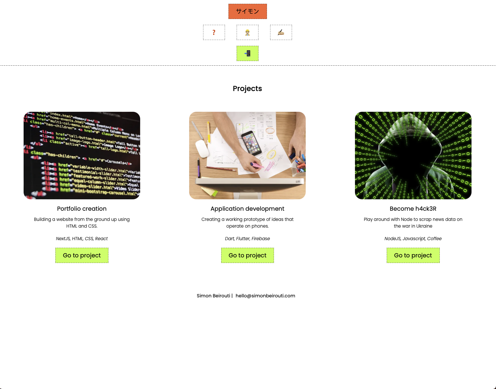
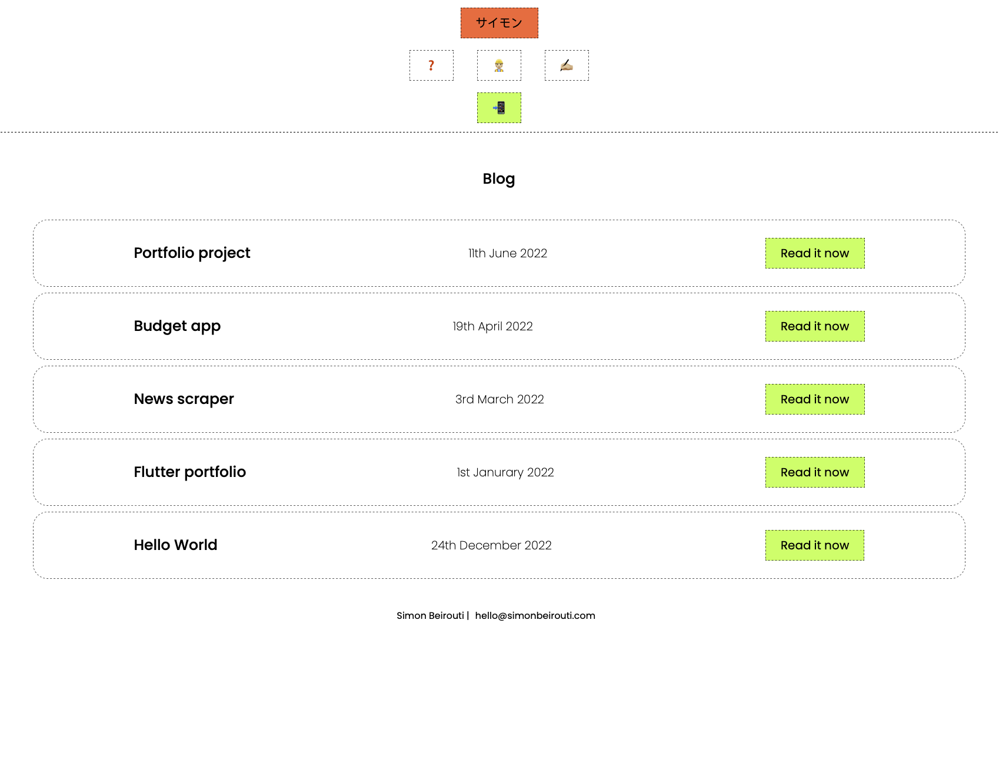

# T1A2 Portfolio Assessment
## Links
- [Published portfolio website](https://t1a2-portfolio.vercel.app)
- [Link to Github Repo](https://github.com/simonbeirouti/t1a2-portfolio)

## Description 
### Installation nstructions
- `npm run dev` starts NextJS in development mode
- `npm run build` builds the application for production
- `npm run start` starts a production server
- `npm run dev` set up built-in ESlint configuration

### Purpose 
Create a portfolio to slowly implement the skills I'm learning and also push myself to learn some newer technologies that I can implement into the website. 

### Functionality/Features
It's super basic and meant to show the basics of website design. I will focus on a better developer experience by creating single components, styling once and sharing that across the entire code base. 

This approach will save me time and constant back and forth, plus it's also common practice so may aswell get used to it. 

### SiteMap
- [Home](https://t1a2-portfolio.vercel.app)
    - [About](https://t1a2-portfolio.vercel.app/about)
    - [Projects](https://t1a2-portfolio.vercel.app/projects)
    - [Blog](https://t1a2-portfolio.vercel.app/blog)
    - [Contact](https://t1a2-portfolio.vercel.app/contact)

### Screenshots
| Home | About | Contact |
| ---- | ---- | ---- |
|  |  |  |

| Projects |  Blog |
| ---- | ---- |
|  |  |

### Target Audience
- Coder academy
- Fellow students
- Recruiters
- Developers

### Tech Stack 
- [NextJs](https://nextjs.org/)
- [React](https://reactjs.org/)
- [HTML](https://www.w3schools.com/html/)
- [CSS](https://www.w3schools.com/css/)
- [JS/JSX](https://reactjs.org/docs/introducing-jsx.html)